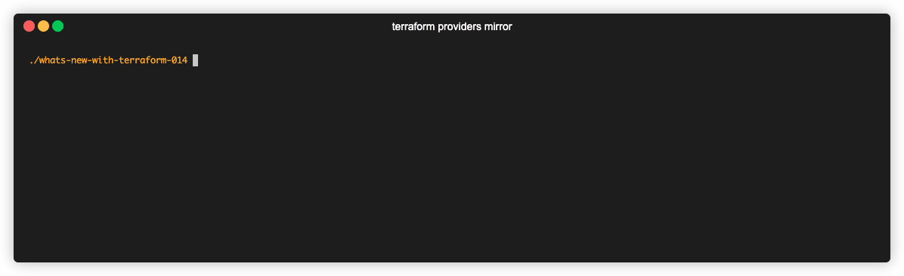

# CLI Enhancement: Local / network Provider Mirrors

From the Terraform `0.13.2` [CHANGELOG](https://github.com/hashicorp/terraform/blob/v0.13/CHANGELOG.md):

> Provider binaries may be mirrored to a local filesystem (or a networked HTTP server) and can be used as an alternative source of installation when directly accessing the origin registries is undesirable.

* Terraform documentation: [Provider installation](https://www.terraform.io/docs/commands/cli-config.html#provider-installation)
* GitHub PR / Issue: [#25999](https://github.com/hashicorp/terraform/issues/25999)

---

## Demonstration

The command used is `terraform providers mirror -platform=darwin_amd64 ./terraform-providers-mirror`.
